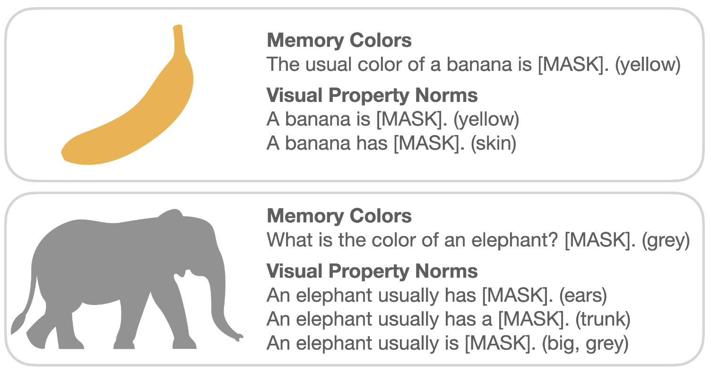

# Measure Visual Commonsense Knowledge



## ACL SRW 2022 paper

["What do Models Learn From Training on More Than Text? Measuring Visual Commonsense Knowledge"](https://aclanthology.org/2022.acl-srw.19.pdf). 

This repo contains the code for the paper.

&nbsp;

## Where to start?

The repo is segmented into three main parts:

1. [models](models) contains code necessary for attaining the models that haven't already been pre-trained and released. These are the BERT baselines trained on visual copora (`bert-clip-bert-train`, `bert-lxmert-train` and `bert-lxmert-train-scratch`) and CLIP-BERT. This repo also contains necessary model weights and code for pretraining.
2. [memory_colors](memory_colors) contains code necessary for the Memory Colors evaluation. As long as you have the necessary model weights under `models/data/model-weights`, this can be run independently from the other directories.
3. [visual_property_norms](visual_property_norms) contains code necessary for the Visual Property Norms evaluation. As long as you have the necessary model weights under `models/data/model-weights`, this can be run independently from the other directories.

Both the Memory Colors evaluation and the Visual Property Norms evaluation depend on pre-trained model weights for the models evaluated. Some of this pre-training needs to be done separately in [models](models).

## Reference

```bibtex
@inproceedings{hagstrom-johansson-2022-models,
    title = "What do Models Learn From Training on More Than Text? Measuring Visual Commonsense Knowledge",
    author = {Hagstr{\"o}m, Lovisa  and
      Johansson, Richard},
    booktitle = "Proceedings of the 60th Annual Meeting of the Association for Computational Linguistics: Student Research Workshop",
    month = may,
    year = "2022",
    address = "Dublin, Ireland",
    publisher = "Association for Computational Linguistics",
    url = "https://aclanthology.org/2022.acl-srw.19",
    pages = "252--261",
    abstract = "There are limitations in learning language from text alone. Therefore, recent focus has been on developing multimodal models. However, few benchmarks exist that can measure what language models learn about language from multimodal training. We hypothesize that training on a visual modality should improve on the visual commonsense knowledge in language models. Therefore, we introduce two evaluation tasks for measuring visual commonsense knowledge in language models (code publicly available at: github.com/lovhag/measure-visual-commonsense-knowledge) and use them to evaluate different multimodal models and unimodal baselines. Primarily, we find that the visual commonsense knowledge is not significantly different between the multimodal models and unimodal baseline models trained on visual text data.",
}
```

## Acknowledgements
This project wouldn't be possible without the Centre for Speech, Language, and the Brain (CSLB) at the University of Cambridge, the [Huggingface](https://huggingface.co/) library and the [LXMERT repo](https://github.com/airsplay/lxmert), we thank you for your work!
