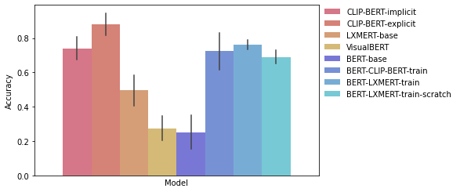

# Memory Colors

This folder contains all the code necessary for reproducing the Memory Colors results presented below. 

The main code is found in [generate-results.ipynb](generate-results.ipynb). It can be used to generate the model results on Memory Colors found under [results.csv](data/results.csv). To be able to run it you need to have downloaded or trained your own model weights and put them under the [model weights folder](../models/data/model-weights) (for model weights not available via Huggingface), see [models](../models). It also relies on the [memory colors data](data/memory_colors.jsonl) which contains the information necessary for the memory colors evaluation.

## How to evaluate your own model

A model is evaluated through the following code block in the [generate-results.ipynb](generate-results.ipynb) notebook:

```python
model_name = [insert model name here]
tokenizer = [insert your model tokenizer here]
model = [insert the model you wish to evaluate here]

device = torch.device('cuda' if torch.cuda.is_available() else 'cpu')
class_names_ids = names_to_token_ids(CLASS_NAMES, tokenizer)
for question_template in QUESTION_TEMPLATES:
    questions = []
    for ex in examples:
        if ex["descriptor"] == '':
            question = question_template.replace("[DESCRIPTOR] ", "").replace("[ITEM]", ex["item"])
        else:
            question = question_template.replace("[DESCRIPTOR]", ex["descriptor"]).replace("[ITEM]", ex["item"])
        questions.append(question)

    # you may want to make alterations to the input for your model
    inputs = tokenizer(questions, return_tensors="pt", padding=True).to(device)
    pred = predict_masked(inputs, tokenizer, model.to(device), class_names_ids).cpu().detach()
    topk = pred.topk(1).indices # Rank color tokens and select top k (batch, k)
    gt = torch.tensor([CLASS_NAMES.index(ex["label"]) for ex in examples]).unsqueeze(1) # Index of ground truth color - (batch, 1)

    precision_at_k = np.true_divide((topk == gt).sum(), gt.shape[0])
    assert len(results[(results.model==model_name) & (results.question_template==question_template)]) == 0, "Should not append results to already existing key values"
    results = results.append({"model": model_name, "question_template": question_template, "accuracy": float(precision_at_k.numpy())}, ignore_index=True).reset_index(drop=True)
```

To evaluate your own model, you simply need to replace the parts in [brackets] with your model information. The necessary queries and functions to measure the metrics are already provided.

## Results

