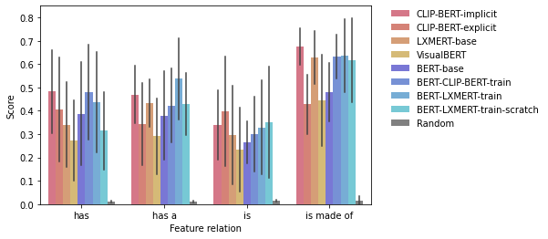

# Visual Property Norms

This folder contains all the code necessary for reproducing the Visual Property Norms results presented at the end of this document. The main code is splitted over the following files:
* [create-visual-property-norms-evaluation.ipynb](create-visual-property-norms-evaluation.ipynb) creates the [queries](data/queries) used for the Visual Property Norms evaluation. It also creates the concepts and features listed in [pf-partitions](data/pf-partitions). To be able to run this notebook, you need to have downloaded the CSLB property norms datafile `norms.dat` to the [data folder](data). Access to the data can be requested via the [CSLB website](https://cslb.psychol.cam.ac.uk/propnorms#:~:text=The%20Centre%20for%20Speech%2C%20Language,feature%20representations%20of%20conceptual%20knowledge). 
* [generate-results.ipynb](generate-results.ipynb) can be used to generate the model results on Visual Property Norms found under `data/results/results.csv`. To be able to run it you need to have downloaded or trained your own model weights and put them under the `../models/data/model-weights` folder (for model weights not available via Huggingface), see [models](../models).
* [analyze-results.ipynb](analyze-results.ipynb) can be used to analyze the generated model results (`data/results/results.csv`) through plots and tables.

Additional support code for modeling CLIP-BERT and LXMERT can be found under [src](../models/src).

## Note

This is derivative work of the CSLB Norms and the CSLB, those who carried out the original collection of data in the CSLB Norms and the funder/s or sponsor/s of the research bear no responsibility for the further analysis or interpretation for the work described here.

## Download existing results

The model results we obtained on Visual Property Norms are available [here](https://chalmers-my.sharepoint.com/:f:/g/personal/lovhag_chalmers_se/EgIEsHUixuZPnJHV7lLCMQ4BFNisHKkKQxpijUOuKvZS9A?e=gRFhdn).

## How to evaluate your own model

A model is evaluated through the following code block in the [generate-results.ipynb](generate-results.ipynb) notebook:

```python
model_name = [insert model name here]
tokenizer = [insert your model tokenizer here]
model = [insert the model you wish to evaluate here]
model.eval()
   
get_preds = [define a function for how to get predicitons from your model with only a list of `questions` as input]

query_files = os.listdir(QUERIES_FOLDER) # this is predefined
results = update_results_with_model_preds(results, get_preds, query_files, tokenizer)
```

To evaluate your own model, you simply need to replace the parts in [brackets] with your model information. Most important is to define the `get_preds` function that takes a list of questions as input and returns a list of model predictions based on these questions. The necessary queries and functions to measure the metrics are already provided.

## Results on VPN

### Across query templates


### Per query template


### Per feature relation type


### Only for colors

